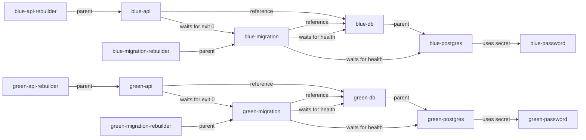

# Blue and green resource topology

Arrows point from a resource to its dependency. Labels distinguish references, parent links, and startup waits.

```mermaid
flowchart LR
    resource0["blue-api"]
    resource1["blue-api-rebuilder"]
    resource2["blue-db"]
    resource3["blue-migration"]
    resource4["blue-migration-rebuilder"]
    resource5["blue-password"]
    resource6["blue-postgres"]
    resource7["green-api"]
    resource8["green-api-rebuilder"]
    resource9["green-db"]
    resource10["green-migration"]
    resource11["green-migration-rebuilder"]
    resource12["green-password"]
    resource13["green-postgres"]
    resource0 -->|"reference"| resource2
    resource0 -->|"waits for exit 0"| resource3
    resource1 -->|"parent"| resource0
    resource2 -->|"parent"| resource6
    resource3 -->|"reference"| resource2
    resource3 -->|"waits for health"| resource2
    resource3 -->|"waits for health"| resource6
    resource4 -->|"parent"| resource3
    resource6 -->|"uses secret"| resource5
    resource7 -->|"reference"| resource9
    resource7 -->|"waits for exit 0"| resource10
    resource8 -->|"parent"| resource7
    resource9 -->|"parent"| resource13
    resource10 -->|"reference"| resource9
    resource10 -->|"waits for health"| resource9
    resource10 -->|"waits for health"| resource13
    resource11 -->|"parent"| resource10
    resource13 -->|"uses secret"| resource12
```
